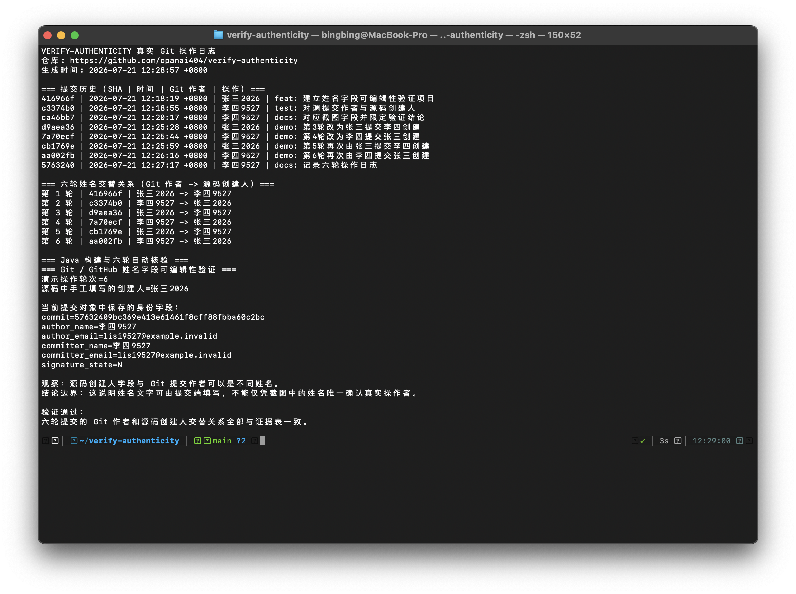
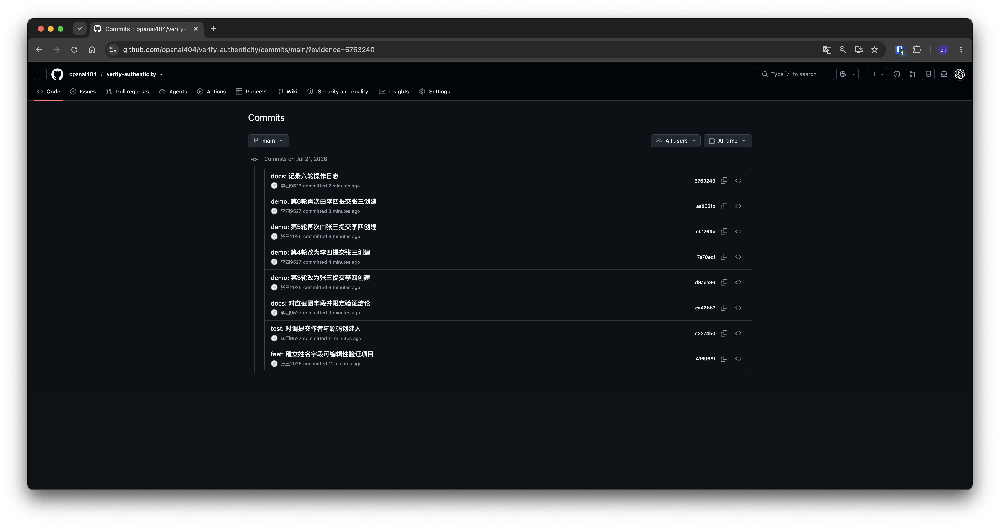
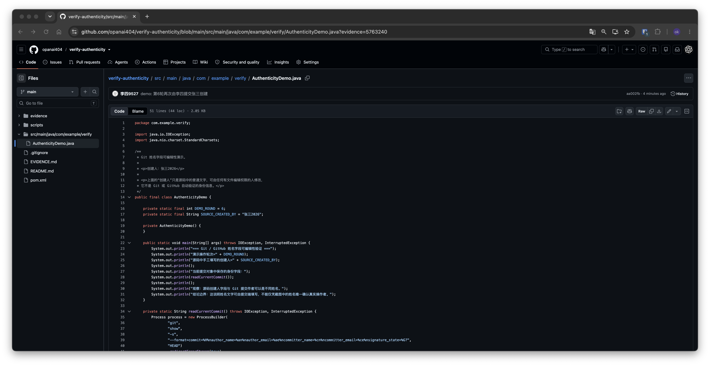

# 操作日志截图说明

这些截图由实际本地终端和 GitHub 公开页面直接截取，没有对画面内容进行合成或文字替换。截图用于展示本复现实验的操作过程，不是原争议事件的现场证据。

## 1. 终端操作日志

- 文件：`screenshots/terminal-operation-log.png`
- 截取时间：2026-07-21 12:29:07 +08:00
- 原始尺寸：2344 × 1750
- SHA-256：`c6ff05433ea200ef335e4f1ac8c717087626552569b5a86f044ff6fb4e3ca869`
- 内容：8 条当时已有的 Git 提交、6 轮“Git 作者 → 源码创建人”交替关系、当前提交对象字段，以及 Java/Maven 自动验证通过结果。



## 2. GitHub 公开提交历史

- 文件：`screenshots/github-commit-history.png`
- 截取时间：2026-07-21 12:30:30 +08:00
- 原始尺寸：4064 × 2138
- SHA-256：`d51e1cb9088e3c83bdf588624c051f097ebb6539a83945495856a73de777434e`
- 内容：`opanai404/verify-authenticity` 的公开 `main` 提交列表，显示“张三2026”和“李四9527”反复交替出现，并显示每次操作的短 SHA。



## 3. GitHub 当前 Java 文件

- 文件：`screenshots/github-current-java-file.png`
- 截取时间：2026-07-21 12:30:57 +08:00
- 原始尺寸：3976 × 2050
- SHA-256：`8989a38dfb635b740930919762333dd30ee2b79803f92a6bbe6dbb848be32439`
- 内容：同一 GitHub 页面上方显示该 Java 文件最近提交者“李四9527”，源码注释和常量同时显示“创建人：张三2026”。



## 校验方法

在仓库根目录运行：

```bash
cd evidence/screenshots
shasum -a 256 -c SHA256SUMS.txt
```

三项均应显示 `OK`。截图提交本身发生在截图完成之后，所以截图里的提交列表不会包含“提交截图证据”这一后续提交；这属于正常的时间先后关系。

